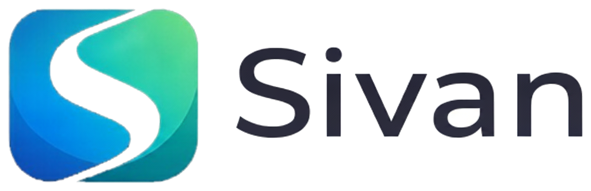

<div align="center">



# Sivan

**WhatsApp-based service agreement coordination & stablecoin off-ramp for freelancers and service businesses.**

[](LICENSE)
[](https://www.avax.network/)
[](https://app.sivantech.online/)
[](https://waitlist.sivantech.online/)
[](https://www.sivantech.online/)

[🌐 Landing Page](https://www.sivantech.online/) · [🚀 App / Dashboard](https://app.sivantech.online/) · [✋ Join Pilot Access](https://waitlist.sivantech.online/)

</div>

---

## 📖 About

**Sivan** is a WhatsApp-native platform that helps freelancers, agencies, and small service businesses:

1. **Structure service agreements** — define scope, pricing, and delivery expectations before work begins.
2. **Coordinate payments** — payments are processed directly through licensed third-party payment providers; Sivan never holds or transmits funds.
3. **Track delivery** — both parties get structured, transparent records of progress and completion.
4. **Off-ramp stablecoins** — convert USDC/USDT on Avalanche C-Chain directly to a local bank account through the Sivan Off-Ramp Dashboard.

> Built for small businesses operating on WhatsApp, with structured records for terms, provider references, delivery updates, and dispute review. Currently live in **Nigeria**, with global expansion planned.

---

## ✨ Features

### 🤝 Service Agreement Coordination (WhatsApp Bot)
| Feature | Description |
|---|---|
| **Clear service agreements** | Define scope, pricing, and delivery expectations before work starts |
| **Mutual term confirmation** | Both buyer and seller confirm terms via WhatsApp before any payment |
| **Licensed payment coordination** | Payments routed through licensed third-party providers — Sivan holds no funds |
| **Delivery tracking** | Structured progress and completion updates recorded for both parties |
| **Dispute review workflow** | Both parties can submit context; structured records give admins a fair review trail |
| **No app download required** | Entire flow runs inside WhatsApp — no new app, no crypto knowledge needed |

### 💱 Off-Ramp Dashboard (`app.sivantech.online`)
| Feature | Description |
|---|---|
| **Crypto → Bank (Sell)** | Send USDC/USDT from any wallet; receive USD, GBP, or EUR to your bank account |
| **Bank → Crypto (Buy)** | Pay via supported bank rails; receive stablecoins to a self-custody wallet *(rollout ready)* |
| **Avalanche C-Chain first** | Launching on Avalanche; Base, Polygon, and Ethereum support planned |
| **Transparent 1.25% fee** | Live fee displayed before a deposit address is generated — no surprises |
| **Non-custodial by design** | Provider-backed settlement; Sivan never asks for private keys |
| **Built-in compliance** | KYC, sanctions screening, anti-fraud checks, and provider requirements in the guided flow |
| **Clear transaction tracking** | Follow address creation → deposit detection → conversion → payout → completion |
| **1–2 day payouts** | Fast settlement through licensed partner bank rails |
| **Multi-currency** | USD, GBP, EUR supported; NGN coming soon |

---

## 🔄 How It Works

### Service Agreement Flow

```
1. Create service agreement  →  Define scope, price, and delivery terms
2. Confirm terms             →  Both buyer and seller confirm via WhatsApp
3. Process payment           →  Routed through a licensed payment provider
4. Deliver service           →  Seller delivers; progress tracked in Sivan
5. Confirm completion        →  Both parties confirm; record is finalized
```

### Off-Ramp Flow (Crypto → Cash)

```
1. Create & verify account   →  Sign up with email + short identity check (KYC)
2. Choose rails & send funds →  Pick bank, asset (USDC/USDT), and network; review fee
3. Receive payout            →  Deposit detected → converted → paid to your bank account
```

---

## 🛠️ Tech Stack

> *The following is inferred from publicly available information on the product websites. Exact internal stack details may differ.*

| Layer | Technology |
|---|---|
| **Blockchain Network** | Avalanche C-Chain (primary); Base, Polygon, Ethereum (planned) |
| **Stablecoins** | USDC, USDT |
| **Messaging Interface** | WhatsApp (via WhatsApp Business API) |
| **Payment Settlement** | Licensed third-party off-ramp / on-ramp providers |
| **Fiat Currencies** | USD, GBP, EUR (NGN coming soon) |
| **Bank Rails** | ACH and provider-supported local rails |
| **Compliance** | KYC / AML, sanctions screening, anti-fraud (built into guided flow) |

---

## 🚀 Getting Started

### For Service Businesses (WhatsApp Bot)

Sivan currently operates in **Nigeria** under a limited pilot. No app download is required.

1. **Request pilot access** at [waitlist.sivantech.online](https://waitlist.sivantech.online/)
2. Once approved, you'll receive onboarding instructions via WhatsApp.
3. Start creating service agreements directly from your WhatsApp chat.

### For the Off-Ramp Dashboard

1. Visit [app.sivantech.online](https://app.sivantech.online/)
2. Click **"Create free account"** and sign up with your email.
3. Complete the short identity verification (KYC) — one verification unlocks both buy and sell flows.
4. Choose your direction (**Sell** crypto → bank, or **Buy** crypto with fiat).
5. Pick your asset, network, and bank rails → review the fee → generate your deposit address.
6. Send funds and track your payout status in real time.

> ⚠️ **Note:** On-ramp (Buy) is rollout-ready and will be enabled as provider partnerships are finalized.

---

## 📱 Usage

### Creating a Service Agreement (WhatsApp)

```
User:  Create agreement for ₦20,000 to seller for dev design

Sivan: Confirm this service agreement?
       • Amount: ₦20,000
       • Service: Dev design
       • Seller: [Seller contact]

User:  YES

Sivan: Agreement created. Seller invited.
       Payment is processed through a licensed provider.
```

**Agreement lifecycle stages:**
- ✅ **Terms confirmed** — both parties agreed
- 💳 **Provider payment** — processed externally by licensed provider
- 🔄 **Delivery** — service in progress
- ✔️ **Completion** — final confirmation by both parties

### Off-Ramp Example (Sell USDC → USD)

```
You send:     1,000 USDC  (≈ $1,000.00)
Sivan fee:    1.25%  →  −$12.50
You receive:  $987.50 USD via ACH
Arrival:      Provider + bank rail timing (typically 1–2 days)
```

---

## 🖼️ Screenshots

> *Replace the placeholders below with actual screenshots of your app.*

| Landing Page | Off-Ramp Dashboard | Agreement Flow |
|:---:|:---:|:---:|
|  |  |  |

---

## 🌍 Availability & Roadmap

| Region / Feature | Status |
|---|---|
| 🇳🇬 Nigeria (WhatsApp coordination) | ✅ Live |
| USDC / USDT on Avalanche C-Chain | ✅ Live |
| USD, GBP, EUR payouts | ✅ Live |
| NGN bank settlement | 🔜 Coming soon |
| On-ramp (Buy crypto with fiat) | 🔜 Rollout ready |
| Base, Polygon, Ethereum support | 🔜 Planned |
| Global expansion | 🔜 Planned |

---

## 🤝 Contributing

Contributions, issues, and feature requests are welcome!

1. **Fork** the repository
2. **Create** your feature branch:
   ```bash
   git checkout -b feature/your-feature-name
   ```
3. **Commit** your changes:
   ```bash
   git commit -m "feat: add your feature description"
   ```
4. **Push** to the branch:
   ```bash
   git push origin feature/your-feature-name
   ```
5. **Open a Pull Request** and describe your changes clearly.

Please read our [Contributing Guidelines](CONTRIBUTING.md) and [Code of Conduct](CODE_OF_CONDUCT.md) before submitting.

---

## 🔒 Security & Compliance

- Sivan **does not hold, store, or transmit funds** at any point.
- All payments are processed by **licensed third-party payment providers**.
- The off-ramp dashboard includes **KYC, sanctions screening, and anti-fraud checks** built into the guided flow.
- Sivan is **non-custodial by design** — private keys are never requested.

---

## 📄 License

This project is licensed under the **MIT License** — see the [LICENSE](LICENSE) file for details.

---

## 📬 Contact & Links

| Resource | Link |
|---|---|
| 🌐 Main Website | [sivantech.online](https://www.sivantech.online/) |
| 🚀 Off-Ramp App | [app.sivantech.online](https://app.sivantech.online/) |
| ✋ Pilot Waitlist | [waitlist.sivantech.online](https://waitlist.sivantech.online/) |
| 📧 Email | *Available on the website* |

---

<div align="center">

**Built for small businesses. Powered by Avalanche. Operating on WhatsApp.**


*Nigeria-first. Built to scale globally.*

</div>
